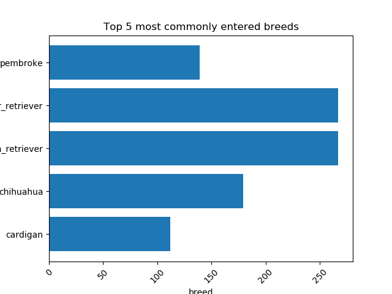

# WeRateDogs Twitter Analysis

**Data wrangling, cleaning, and visualization project** that demonstrates end-to-end data analysis skills used in real business settings.

## Business Problem
WeRateDogs ran a Twitter contest to raise awareness about shelter dogs. Approximately 1.1 million dogs enter U.S. shelters each year, yet many are never adopted. The goal was to highlight the most popular breeds and highest-rated dogs to encourage adoptions.

## What I Did
- Collected data from three sources: Twitter archive CSV, image-prediction TSV, and Twitter API (via Tweepy).
- Merged datasets, removed retweets and non-dog entries, standardized names and breeds, and converted data types.
- Cleaned 8 quality issues and 2 tidiness issues using Pandas.
- Performed exploratory analysis and created visualizations to surface actionable insights.

## Key Findings
- Top 5 most common breeds: Golden Retriever, Labrador Retriever, Chihuahua, Pembroke, Cardigan.
- Identified highest- and lowest-scoring breeds to celebrate both popular and under-appreciated dogs.

## Visualization

## Project Files
- **wrangle_act.ipynb** – Full Jupyter notebook showing every step (data gathering → cleaning → analysis → visualization)
- **wrangle_report.pdf** – Detailed wrangling documentation
- **act_report.pdf** – Final insights and business recommendations

## Tools & Skills Demonstrated
- Python (Pandas, Requests, Tweepy, Matplotlib)
- Data cleaning & wrangling
- Multi-source data merging
- Exploratory analysis & visualization
- Clear technical documentation

## How to Explore
1. Open `wrangle_act.ipynb` directly in GitHub (it renders automatically).
2. Read the PDF reports for clean summaries.
3. All original data files are excluded to keep the repo lightweight.

This project shows the exact skills I use to collect, clean, analyze, and present data — the same work required for the Data Analyst role at Schepmont Group.
